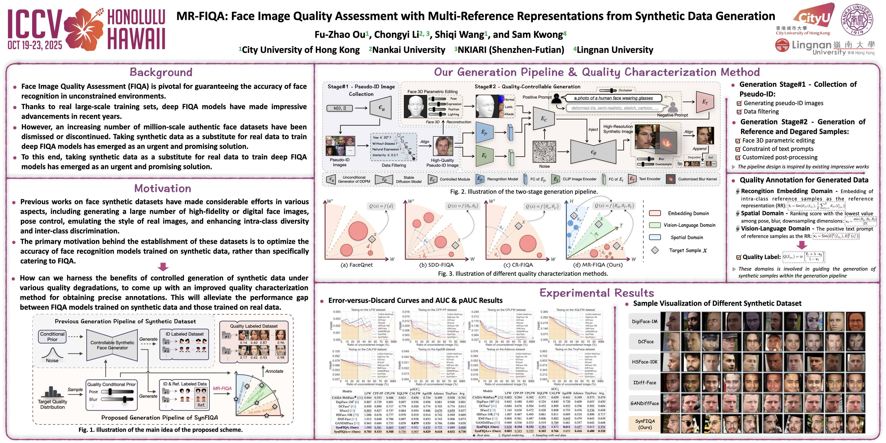

<table>
<tr>
<td width="15%" valign="middle">

</td>
<td valign="middle" align="center">

# MR-FIQA: Face Image Quality Assessment with Multi-Reference Representations from Synthetic Data Generation

<a href='https://'></a> &nbsp; &nbsp; <a href='https://'></a> &nbsp; &nbsp; <a href='https://'></a> &nbsp; &nbsp; <a href='https://'></a>  
*The link will be available soon*

</td>
</tr>
</table>


## 🔎 Description
####
This is the official repository for the following paper 
> **MR-FIQA: Face Image Quality Assessment with Multi-Reference Representations from Synthetic Data Generation**  
> [Fu-Zhao Ou](https://www.oufuzhao.com/) &nbsp; &nbsp; [Chongyi Li](https://scholar.google.com/citations?user=1_I0P-AAAAAJ&hl=en&oi=ao) &nbsp; &nbsp; [Shiqi Wang](https://scholar.google.com/citations?user=Pr7s2VUAAAAJ&hl=en&oi=ao) &nbsp; &nbsp; [Sam Kwong](https://scholar.google.com/citations?user=_PVI6EAAAAAJ&hl=en&oi=ao)  
> **IEEE/CVF International Conference on Computer Vision (ICCV), 2025.**

<div align="center"> </div>
📘 Privacy concerns are limiting the use of real face datasets for training Face Image Quality Assessment (FIQA) models. To address this, we pioneer a synthetic dataset for FIQA, generated via quality-controllable methods like latent space alignment in Stable Diffusion and 3D facial editing. We also propose MR-FIQA method that leverages multi-reference representations among recognition embedding, spatial, and visual-language domains for accurate quality annotation. Experiments validate our approach, showing SynFIQA and MR-FIQA effectively advance FIQA research.


## ⚙️ Environment
####

- <font color='seagreen'> **Stage-1 Generation** </font>: The code in this stage is mainly built on the PyTorch framework. Specifically, it requires PyTorch version 1.10.0 or later, along with the torchvision library. Additionally, you need the CUDA-enabled GPU machine to run the code effectively. Make sure to install the following dependencies:
```bash
$ conda create -n synfiqa python=3.8.16
$ conda activate synfiqa
$ conda install pytorch==2.2.0 torchvision==0.17.0 torchaudio==2.2.0 pytorch-cuda=11.8 numpy==1.22.0 -c pytorch -c nvidia 
$ pip install pyrootutils opencv-python tqdm facenet-pytorch==2.5.3 scikit-image tf-keras
$ conda install -c conda-forge dlib tensorflow-gpu=2.13 deepface
```

- <font color='seagreen'> **Stage-2 Generation** </font>: This stage mainly relies on the PyTorch and Pytorch3D framework. Please follow [PyTorch3D-Install](https://github.com/facebookresearch/pytorch3d/blob/main/INSTALL.md) to install the suitable Pytorch3D based on the version of Python, PyTorch, and CUDA. 
- You can also find and download the appropriate version of PyTorch at [Anaconda-PyTorch](https://anaconda.org/pytorch3d/pytorch3d/files). The py??, cu???, and pyt??? indicate the Python, CUDA, and PyTorch versions. For instance, [pytorch3d-0.7.8-py38_cu118_pyt220.tar.bz2](https://drive.google.com/file/d/1RXzU9RQqF1E0KZz2S4zgMA1xTp-E33Ar/view?usp=sharing) should be installed under the Python=3.8, CUDA=11.8, and PyTorch=2.2.0. 
Make sure to install the following dependencies:
```bash
$ conda install pytorch3d-0.7.8-py38_cu118_pyt220.tar.bz2
$ pip install gradio==3.34.0 yacs chumpy kornia==0.6.12 iopath fvcore face-alignment==1.3.5 triton==2.2.0 omegaconf open-clip-torch==2.24.0 transformers==4.24.0 einops xformers==0.0.24 pytorch-lightning==1.9.0
```

- <font color='seagreen'> **Quality Annotation** </font>: The code of quality annotation is mainly built on BLIP and facenet-pytorch. Please download [BLIP-Model](https://storage.googleapis.com/sfr-vision-language-research/BLIP/models/model_base_retrieval_coco.pth) and place in `Pretrained-Models/`.
```bash
$ pip install fairscale==0.4.4 pycocoevalcap scipy==1.10.1
```

## 📂 Data Generation and Annotation
####
#### 🧬 1. Unconditional Generation of Pseudo-ID Images (*Stage-1*)

- A pretrained model of an unconditional generator can be downloaded at this [Google-Drive-Link](https://drive.google.com/file/d/1f1ObNf2Q7671izTFwdtN205koEStLvNH/view?usp=drive_link) and placed in `Pretrained-Models/Unc-Diff-Stage1.pth`. 
- You can also modify the <font color='tomato'> *<save_dir>* </font> in `Stage-1/generate_pseudo_ID.py` to change the saving path of the generated images.
```bash
$ python Stage-1/generate-pseudo-ID.py
```

#### 🕵🏻 2. Data Filtering for High-Quality Pseudo-ID Images
- To ensure high-quality pseudo identities, the generated images will be filtered as required to eliminate samples that do not meet the requirements. 
- Download the [ZIP-File](https://drive.google.com/file/d/1XaYY8MZBGMYOfFKI6-gwzOtgzS_ecGqp/view?usp=sharing) containing the models required for data filtering, and unzip it to `Pretrained-Models/`. Herein, it is worth mentioning that `Retinaface_Resnet50.pth` and `Pose-LP.pth` will also be used in the following <font color='seagreen'> **Quality-Controlled Generation**</font>.
- If you modify <font color='tomato'> *<save_dir>* </font> in the previous unconditional generation, please modify the <font color='tomato'> <*data_path*> </font> in `Stage-1/data_filtering.py` simultaneously.
```bash
$ python Stage-1/data_filtering.py
```

#### 🗃️ 3. Quality-Controlled Generation (*Stage-2*)
- Download the [DECA-Stage2-Models-File.zip](https://drive.google.com/file/d/1k0ddZPe2qXJAtsLfQ-lALRQWbtwUVDGU/view?usp=sharing) (10.48GB) and unzip the data and models to `Pretrained-Models/`. 
- The default <font color='tomato'> *<args.id_data_path>* </font> refers to <font color='tomato'> *<data_path>* </font> in <font color='seagreen'> **Data Filtering** </font> of Stage-1. If you modify the path during Stage-1, please make the corresponding changes in `Stage-2/conditional_sampling.py`. You can also modify the saving path of generated samples <font color='tomato'> *<args.save_path>*</font>.
- The generated dataset is divided into sub-files based on the ID. Each sub-folder contains reference and degraded samples. Among them, the reference samples are labeled as `Ref-??.jpg`, while the degraded samples are `?.jpg`. 
- Meanwhile, the absolute yaw angle, downsampling intensity, and blur intensity parameters of the degraded samples will be recorded and used in the subsequent <font color='seagreen'> **Quality Annotation** </font> process. 
```bash
$ python Stage-2/sampling_annotation.py
```

#### 🏷 4. Quality Annotation
- After the samples are generated, quality annotation will be performed. The quality scores of generated data will be output to <font color='tomato'> *<args.save_path>/Quality-Scores.txt* </font>

- In summary, the generated dataset is organized as:
```
──────────────────────────────────────────
|── data                                                           
│   ├── 0                                                                                                  
│   │   └── 0.jpg 
│   │   └── 1.jpg 
|   |   └── ...
│   │   └── Ref-0.jpg   
│   │   └── Ref-1.jpg                                        
|   |   └── ...
|   ├── 1
│   │   └── 0.jpg 
│   │   └── 1.jpg 
|   |   └── ...
│   │   └── Ref-0.jpg   
│   │   └── Ref-1.jpg  
|   |   └── ...
|   ...
├── Quality-Scores.txt
──────────────────────────────────────────
```

## 🎯 Leaderboard for FIQA Models
####
The Leaderboard of different FIQA models trained on real (CASIA-WebFace) and synthetic (Syn.) datasets for average pAUC (↓) under various False Match Rates (FMRs) is reported in the following. These models are trained via [CR-FIQA](https://github.com/fdbtrs/CR-FIQA). You can also download the explicit checkpoint via the URL in the table below.

|   Models  | Data Generation | Data Type  | FMR=1E-2 |  FMR=1E-3 | FMR=1E-4  |                            URL                              |
| :-----------: | :-----------: | :-----------: | :----: | :---: | :---: | :----------------------------------------------------------: |
|  CASIA-WebFace |  - |  Real  |  0.719  | 0.701 | 0.718 | [Google Disk](https://drive.google.com/file/d/1NJlPGQeORIh5JuRwPzFyJtVKIDPT0dwR/view?usp=drive_link) |
|  DigiFace-1M |  Digital rendering |  Syn. |  0.764  | 0.801 | 0.810| [Google Disk](https://drive.google.com/file/d/1zL_oNbQdpD3O5_E7iGXFRddS5kfIopEz/view?usp=drive_link) |
|  DCFace |  Diffusion–Based |  Syn.  |  0.833  | 0.813 | 0.819 | [Google Disk](https://drive.google.com/file/d/1zQihIj_3GUomJKdvYWH8xpz3MZ3xKDC1/view?usp=drive_link) |
|  SFace2 |  GAN-Based |  Syn.   |  0.838  | 0.837 | 0.838 | [Google Disk](https://drive.google.com/file/d/11IVcp6aBQeOR-nU7Wz3UkSpFf-4r-Mhm/view?usp=drive_link) |
|  HSFace-10K |  GAN-Based |  Syn.   |  0.894  | 0.869 | 0.859 | [Google Disk](https://drive.google.com/file/d/18jCvQ9UN7R3QAFqSf33u9kgx3vLWr8bp/view?usp=drive_link) |
|  IDiff-Face |  Diffusion–Based |  Syn.   |  0.873  | 0.873 | 0.846 | [Google Disk](https://drive.google.com/file/d/1DRPmQRVW-pAaJ71fG62QVCMomA8rgVrz/view?usp=drive_link) |
|  GANDiffFace |  GAN-Diffusion–Based |  Syn.   |  0.838  | 0.830 | 0.828 | [Google Disk](https://drive.google.com/file/d/1_STQPihDlN8DViH3qnqwdIWqOkFpDwiA/view?usp=drive_link) |
|  SynFIQA (Ours) |  Diffusion–Based |  Syn.   |  0.797  | 0.800 | 0.787 | [Google Disk](https://drive.google.com/file/d/1VGH7RSrEkxREB5NFM-dcqAAdDY45LhE2/view?usp=drive_link) |
|  SynFIQA++ (Ours) |  Diffusion–Based |  Syn.   |  0.748  | 0.730 | 0.742 | [Google Disk](https://drive.google.com/file/d/1l9z9tjBZkgr_-QCLnawx9aEmJnW9cJwZ/view?usp=drive_link) |
|  SynFIQA + CASIA (Ours) |  - |  Real + Syn.  |  0.715  | 0.652 | 0.644 | [Google Disk](https://drive.google.com/file/d/1URGG2K5jL4xiuR57Z--zuRy3M6R7F9jn/view?usp=drive_link) |


## 🚀 FIQA Inference
####
You can use the above FIQA model to predict the FIQA score. Modify the <font color='tomato'> *<img_path>* </font> and <font color='tomato'> *<model_path>* </font> in `fiqa_inference.py`. 

```bash
$ python fiqa_inference.py
```

## ❣️ Citing this Repository
Please kindly cite the following paper if you find our work helpful. Thank you so much~ 🙏🙏🙏
```
@InProceedings{Ou_2025_ICCV,
    author    = {Ou, Fu-Zhao and Li, Chongyi and Wang, Shiqi and Kwong, Sam},
    title     = {MR-FIQA: Face Image Quality Assessment with Multi-Reference Representations from Synthetic Data Generation},
    booktitle = {Proceedings of the IEEE/CVF International Conference on Computer Vision (ICCV)},
    year      = {2025}
}
```

## 💡 Acknowledgements
Our code is primarily adopted from the following projects and we would like to express our great gratitude to the authors of these projects for their exceptional contributions and valuable works!
- [DCFace](https://github.com/mk-minchul/dcface)
- [CpaHuman](https://github.com/VamosC/CapHuman)
- [6DRepNet360](https://github.com/thohemp/6DRepNet360)
- [RetinaFace](https://github.com/serengil/retinaface)
- [AdaFace](https://github.com/mk-minchul/AdaFace)
- [CR-FIQA](https://github.com/fdbtrs/CR-FIQA)
- [Glasses Detection](https://github.com/TianxingWu/realtime-glasses-detection)
- [DeepFace](https://github.com/serengil/deepface)
- [BLIP](https://github.com/salesforce/BLIP)

## 🔑 License
This project is licensed under the Attribution-NonCommercial 4.0 International (CC-BY-NC 4.0 license). Please check LICENSE for details.